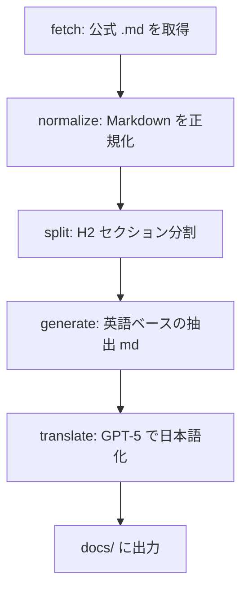

# Anthropic Best Practices 同期パイプライン

このプロジェクトでは、Anthropic 公式ドキュメントを **決定論的に取得**し、Best Practices を Markdown 化して `docs/` に反映する。

## 目的

- 公式ドキュメントの差分を安定して追跡する
- 生成物は **日本語**（翻訳は GPT-5）
- できる限りコード化・再実行可能な形にする

## フロー

## スクリプト

1. 取得  
   `scripts/anthropic_fetch.rb --all`

2. 正規化  
   `scripts/anthropic_normalize.rb --all`

3. セクション分割  
   `scripts/anthropic_split_sections.rb --all`

4. 英語抽出（生成物は data/ に保存）  
   `scripts/anthropic_generate_claude_md.rb`

5. 翻訳（GPT-5）  
   `OPENAI_API_KEY=... scripts/openai_translate_markdown.rb`  
   1Password 経由なら: `scripts/openai_translate_markdown.rb --use-1password`

## 出力場所

- 取得スナップショット: `data/anthropic/snapshots/`
- 正規化: `data/anthropic/normalized/`
- 分割: `data/anthropic/sections/`
- 生成（英語）: `data/anthropic/generated/claude-md.en.md`
- 生成（日本語）: `docs/best-practices/claude-md.md`

## 翻訳ルール（GPT-5）

- Markdown 構造は維持（見出し/箇条書き/表/引用）
- コードブロックとインラインコードは **変更しない**（プレースホルダ保護）
- URL はそのまま
- 余計な説明は加えない

## 依存

- `pandoc`（HTMLフォールバックの正規化用）
- `OPENAI_API_KEY`（翻訳用）
  - 1Password から取得する場合: `OPENAI_API_KEY=$(op read "op://Personal/OpenAI API Key/credential")`
