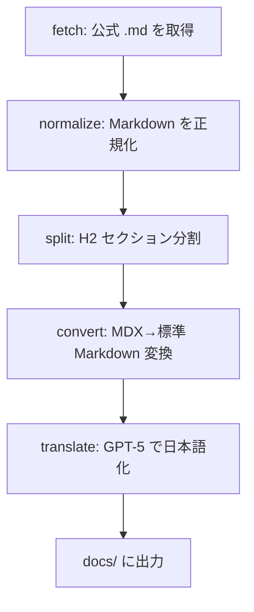

# Anthropic Best Practices 同期パイプライン

このプロジェクトでは、Anthropic 公式ドキュメントを **決定論的に取得**し、Best Practices を Markdown 化して `docs/` に反映する。

## 目的

- 公式ドキュメントの差分を安定して追跡する
- 生成物は **日本語**（翻訳は GPT-5）
- できる限りコード化・再実行可能な形にする

## フロー



## スクリプト（個別実行）

1. 取得  
   `skills/doc-fetcher/scripts/doc_fetcher.rb fetch --url <url> [--url <url> ...]`  
   ※ id は URL から自動生成される（`list --url <url>` で確認可能）

2. 正規化  
   `skills/md-normalizer/scripts/anthropic_normalize.rb normalize --all`

3. セクション分割  
   `skills/md-section-splitter/scripts/anthropic_split_sections.rb split --all`

4. 英語変換（MDX タグ等を標準 Markdown へ）  
   `skills/md-converter/scripts/anthropic_convert.rb convert --all`

5. 翻訳（GPT-5）  
   `OPENAI_API_KEY=... skills/md-translator/scripts/openai_translate_markdown.rb`  
   1Password 経由なら: `skills/md-translator/scripts/openai_translate_markdown.rb --use-1password`

## 一括実行（推奨）

```bash
skills/anthropic-best-practices-update/scripts/run_pipeline.sh
```

特定ソースのみ（id は URL から自動生成）:

```bash
skills/anthropic-best-practices-update/scripts/run_pipeline.sh --id <source-id>
```

翻訳を省略:

```bash
skills/anthropic-best-practices-update/scripts/run_pipeline.sh --skip-translate
```

## 出力場所

- 取得スナップショット: `data/doc-fetcher/snapshots/`
- 正規化: `data/doc-fetcher/normalized/`
- 分割: `data/doc-fetcher/sections/`
- 生成（英語）: `data/doc-fetcher/generated/<source-id>.en.md`
- 生成（日本語）: `docs/best-practices/<source-id>.md`

## 翻訳ルール（GPT-5）

- Markdown 構造は維持（見出し/箇条書き/表/引用）
- コードブロックとインラインコードは **変更しない**（プレースホルダ保護）
- URL はそのまま
- 余計な説明は加えない

## 依存

- `pandoc`（HTMLフォールバックの正規化用）
- `OPENAI_API_KEY`（翻訳用）
  - 1Password から取得する場合: `OPENAI_API_KEY=$(op read "op://Personal/OpenAI API Key/credential")`
- `openssl` gem（CRL エラー回避のため）
  - `bundle install` を実行して 3.3.2 以上を使用する

## トラブルシューティング

- SSL 証明書エラーが出る場合: `--insecure` を使用  
  例: `skills/anthropic-best-practices-update/scripts/run_pipeline.sh --insecure`
- tmux については `plans/tmux-memo.md` を参照
- 定期実行は `docs/operations/systemd-timer.md` を参照
