# UOCS vs AgentMem 比較

## 全体オーバービュー

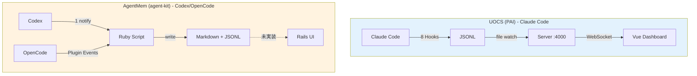

## 概要

| 項目 | UOCS (PAI) | AgentMem (agent-kit) |
|------|------------|---------------------|
| 言語 | TypeScript (Bun) + Vue 3 | Ruby |
| 目的 | リアルタイム監視ダッシュボード | 作業成果の自動保存 |
| 設計思想 | No Database, Fire and Forget | 構造化 Markdown 永続化 |
| **プラットフォーム** | **Claude Code** | **Codex / OpenCode** |

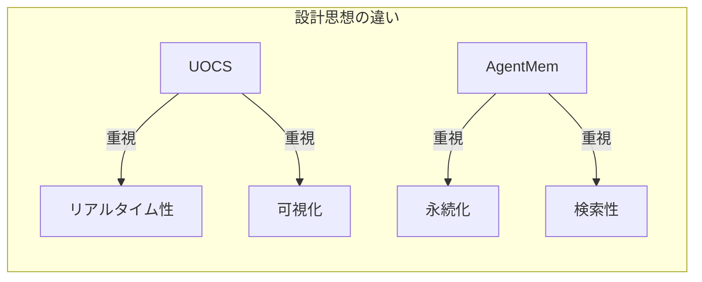

---

## 0. プラットフォームの違い（根本原因）

**UOCS と AgentMem のアーキテクチャの違いは、Claude Code と Codex のフックシステムの違いに起因する。**

### Claude Code のフック（8種類）

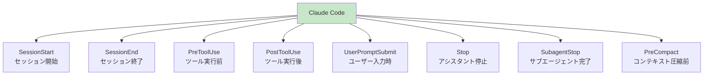

| フック | タイミング | 用途例 |
|--------|------------|--------|
| `SessionStart` | セッション開始 | コンテキスト注入、初期化 |
| `SessionEnd` | セッション終了 | サマリー生成、クリーンアップ |
| `PreToolUse` | ツール実行前 | セキュリティ検証、コマンドブロック |
| `PostToolUse` | ツール実行後 | ログ記録、アクショントリガー |
| `UserPromptSubmit` | ユーザー入力時 | 入力処理、UI更新、評価キャプチャ |
| `Stop` | アシスタント停止 | 作業サマリー、音声通知 |
| `SubagentStop` | サブエージェント完了 | エージェント出力キャプチャ |
| `PreCompact` | コンテキスト圧縮前 | 重要コンテキスト保存 |

### Codex のフック（1種類）

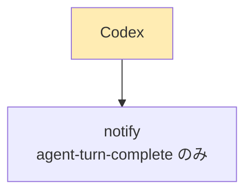

```toml
# ~/.codex/config.toml
notify = ["ruby", "/path/to/script.rb"]
```

→ **ターン完了時の 1 イベントのみ**。途中経過（ツール呼び出し、ユーザー入力）は取得不可。

> 📌 **将来の可能性**: Codex にも Claude Code 風フックを追加する feature request がある。  
> → [openai/codex#2109](https://github.com/openai/codex/issues/2109)  
> （2026-01 時点では未実装。PR #2904 も未マージ）

### OpenCode のプラグインイベント（多数）

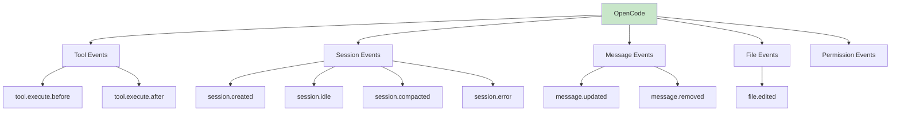

OpenCode は **プラグインシステム** でイベントフックを提供。Claude Code と同等の機能が実現可能。

```typescript
// ~/.config/opencode/plugins/my-plugin.ts
export const MyPlugin = async ({ $, client }) => {
  return {
    "tool.execute.before": async (input, output) => { /* PreToolUse 相当 */ },
    "tool.execute.after": async (input, output) => { /* PostToolUse 相当 */ },
    event: async ({ event }) => {
      if (event.type === "session.idle") { /* Stop 相当 */ }
      if (event.type === "session.created") { /* SessionStart 相当 */ }
    }
  }
}
```

| OpenCode Event | Claude Code 相当 | 説明 |
|----------------|-----------------|------|
| `tool.execute.before` | PreToolUse | ツール実行前（ブロック可） |
| `tool.execute.after` | PostToolUse | ツール実行後 |
| `session.created` | SessionStart | セッション開始 |
| `session.idle` | Stop | セッション完了 |
| `session.compacted` | PreCompact | コンテキスト圧縮時 |
| `message.updated` | UserPromptSubmit | メッセージ更新 |
| `file.edited` | - | ファイル編集時 |

> 📖 **参考**: [OpenCode Plugin Documentation](https://opencode.ai/docs/plugins/)

### 比較

```mermaid
graph TB
    subgraph "Claude Code (8 hooks)"
        direction LR
        C1[SessionStart] --> C2[UserPromptSubmit]
        C2 --> C3[PreToolUse]
        C3 --> C4[PostToolUse]
        C4 --> C5[Stop]
        C4 --> C6[SubagentStop]
    end

    subgraph "OpenCode (Plugin Events)"
        direction LR
        O1[session.created] --> O2[message.updated]
        O2 --> O3[tool.execute.before]
        O3 --> O4[tool.execute.after]
        O4 --> O5[session.idle]
    end

    subgraph "Codex (1 hook)"
        direction LR
        X1[...処理中...] --> X2[notify]
    end

    style C1 fill:#c8e6c9
    style C2 fill:#c8e6c9
    style C3 fill:#c8e6c9
    style C4 fill:#c8e6c9
    style C5 fill:#c8e6c9
    style C6 fill:#c8e6c9
    style O1 fill:#c8e6c9
    style O2 fill:#c8e6c9
    style O3 fill:#c8e6c9
    style O4 fill:#c8e6c9
    style O5 fill:#c8e6c9
    style X2 fill:#ffecb3
```

| 観点 | Claude Code | OpenCode | Codex |
|------|-------------|----------|-------|
| フック数 | 8種類 | 多数（Plugin） | 1種類 |
| リアルタイム監視 | ✅ 可能 | ✅ 可能 | ❌ 不可 |
| ツール実行前介入 | ✅ PreToolUse | ✅ tool.execute.before | ❌ なし |
| セキュリティ検証 | ✅ ブロック可 | ✅ throw でブロック | ❌ 事後のみ |
| 途中経過取得 | ✅ 各フックで | ❌ transcript 遡りで再構成 |
| セキュリティ検証 | ✅ PreToolUse でブロック可 | ❌ 事後のみ |

**結論**: AgentMem が「transcript を遡って再構成」するのは、Codex では途中イベントを直接取れないため。これがアーキテクチャの違いの根本原因。

---

## 1. アーキテクチャの違い

### UOCS アーキテクチャ

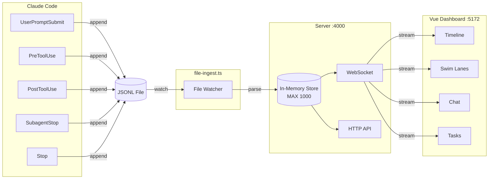

**特徴:**
- **リアルタイムストリーミング**: ファイル変更を即座に検知し WebSocket で配信
- **インメモリ中心**: 最大 1000 イベントをメモリに保持、DB 不要
- **サーバー常駐**: Port 4000 で HTTP/WebSocket サーバーが稼働

### AgentMem アーキテクチャ

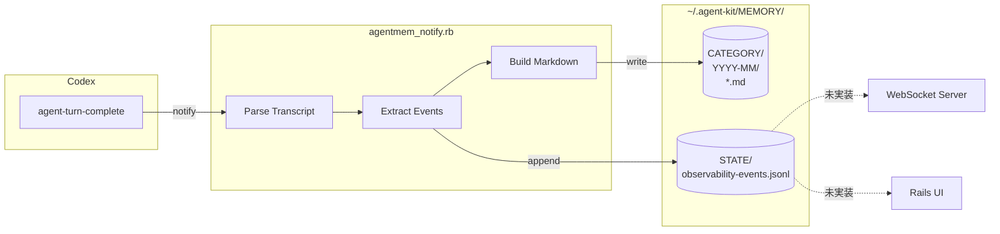

**特徴:**
- **バッチ処理**: イベント発生時に Ruby スクリプトを起動
- **ファイル永続化中心**: Markdown + JSONL でディスクに保存
- **サーバーレス**: 常駐プロセス不要

---

## 2. イベント取得の違い

> 💡 **なぜ違うのか？** → セクション 0「プラットフォームの違い」参照。Claude Code は 8 種類のフックを持つが、Codex は 1 種類（notify）のみ。

### UOCS のイベントフロー（リアルタイム）

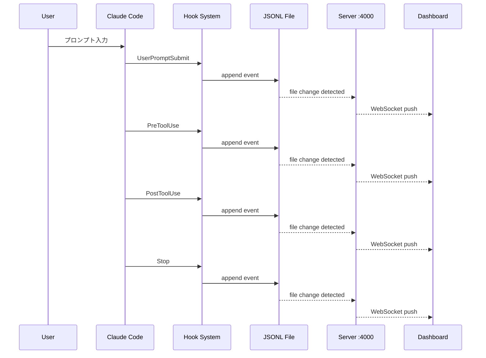

| ホック | トリガー | 用途 |
|--------|----------|------|
| `UserPromptSubmit` | ユーザー入力時 | プロンプト記録 |
| `PreToolUse` | ツール実行前 | ツール呼び出し記録 |
| `PostToolUse` | ツール実行後 | ツール結果記録 |
| `SubagentStop` | サブエージェント完了 | エージェント結果保存 |
| `Stop` | アシスタント停止 | レスポンス記録 |

### AgentMem のイベントフロー（事後再構成）

> ⚠️ Codex は `notify` 1 種類しかないため、transcript を遡って過去イベントを再構成する必要がある

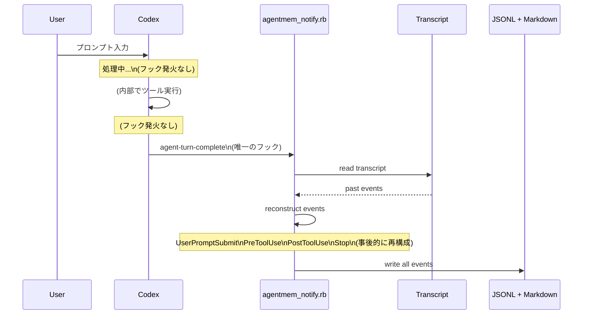

| 観点 | 内容 |
|------|------|
| 入力トリガー | `agent-turn-complete` 1 種類のみ |
| 出力イベント | 5 種類 (UserPromptSubmit, PreToolUse, PostToolUse, Stop, agent-turn-complete) |
| 配信 | なし (JSONL ファイルに書き出すのみ) |

### イベント取得の比較

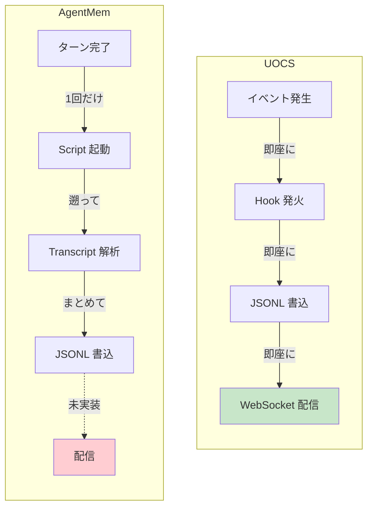

**差分**: UOCS はイベント発生時に即座に WebSocket 配信。AgentMem は事後的にまとめて JSONL 書き出し（配信なし）。

---

## 3. メモリ保存の違い

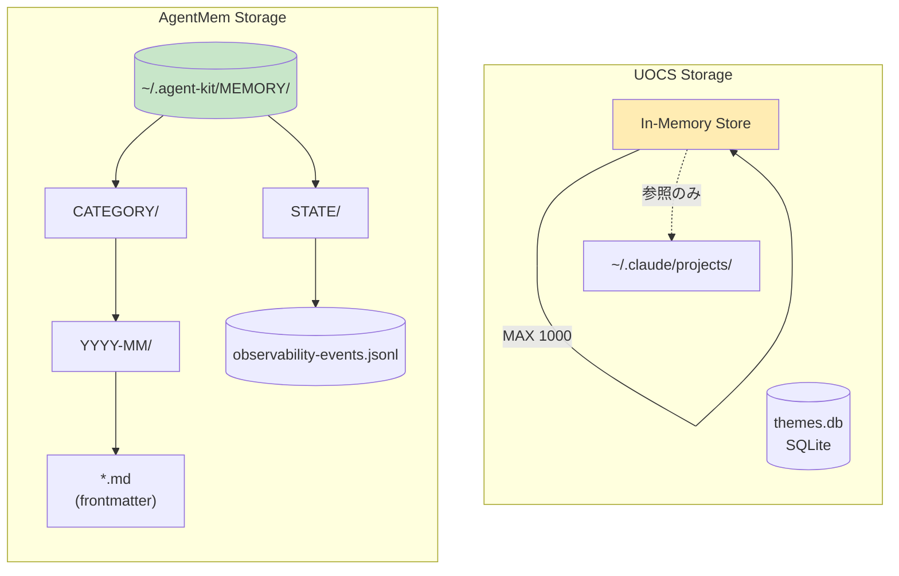

### UOCS
- イベントは **揮発性**（サーバー再起動で消失）
- Claude Code の `~/.claude/projects/` を **読み取り専用** で参照

### AgentMem
- **永続化優先**: すべての出力を Markdown で保存
- 月別ディレクトリで **時系列整理**
- frontmatter で **メタデータ検索** 可能

**差分**: UOCS はリアルタイム可視化優先、AgentMem は永続化・検索優先。

---

## 4. メモリ活用・検索の違い

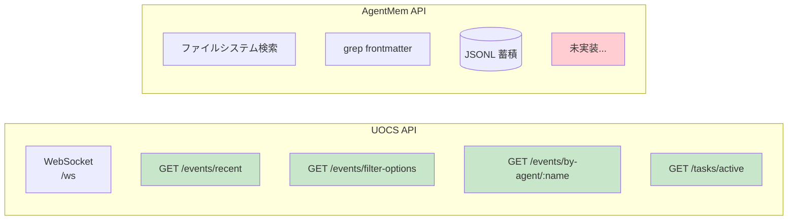

### UOCS（実装済み）

| 機能 | 説明 |
|------|------|
| WebSocket ストリーミング | リアルタイムイベント配信 |
| HTTP API | `/events/recent`, `/events/filter-options` 等 |
| フィルタ機能 | source_app, session_id, event_type で絞り込み |
| エージェント横断検索 | `/events/by-agent/:agentName` |
| バックグラウンドタスク監視 | 実行中タスクのステータス表示 |
| Haiku 要約 | LLM による自動要約生成 |

### AgentMem（現状）

| 機能 | 説明 |
|------|------|
| ファイルシステム検索 | `CATEGORY/<YYYY-MM>/` ディレクトリ構造 |
| frontmatter 検索 | grep 等で agent_type, timestamp 検索可能 |
| JSONL イベント | 観測イベントをファイルに蓄積 |

**未実装機能**:
- [ ] WebSocket ストリーミング
- [ ] HTTP API エンドポイント
- [ ] リアルタイムフィルタ UI
- [ ] エージェント横断検索 API
- [ ] バックグラウンドタスク監視
- [ ] LLM による要約生成

---

## 5. ダッシュボードの違い

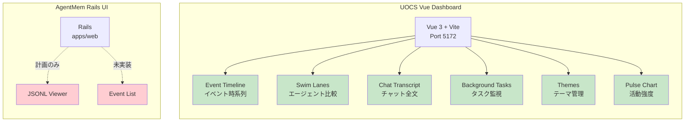

---

## 6. 通知機能の違い

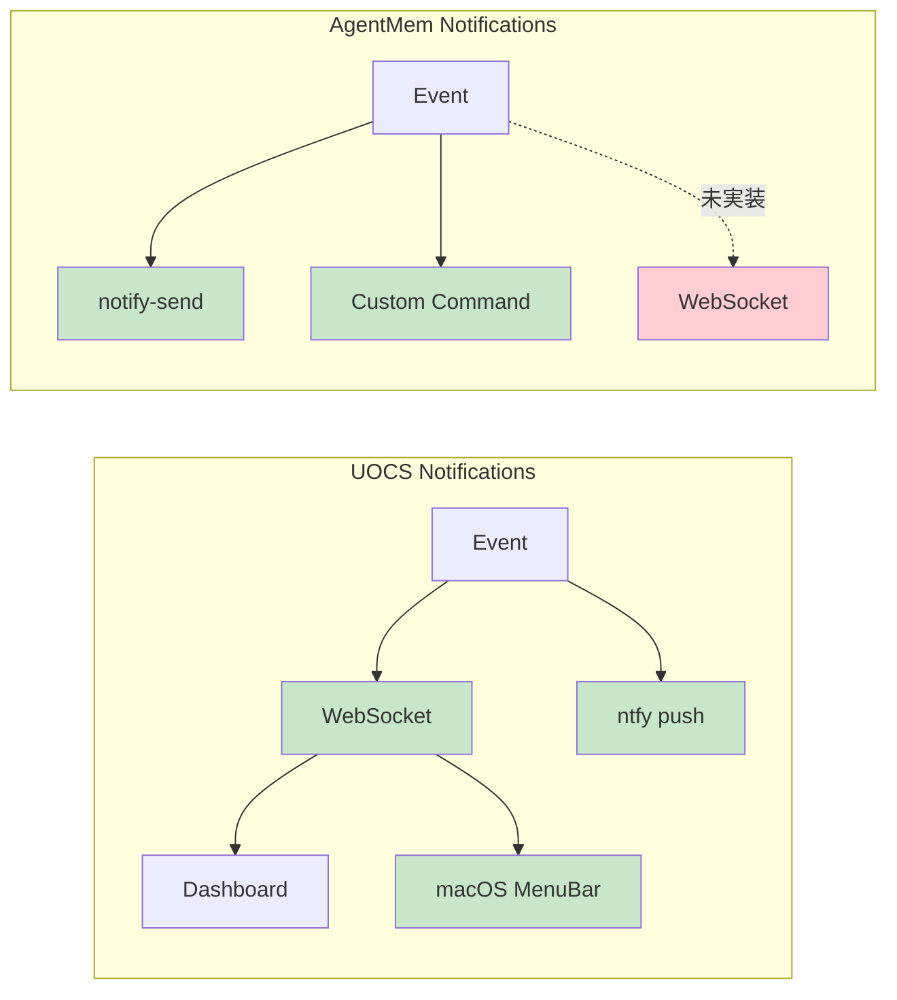

---

## 7. 設定・スキーマの違い

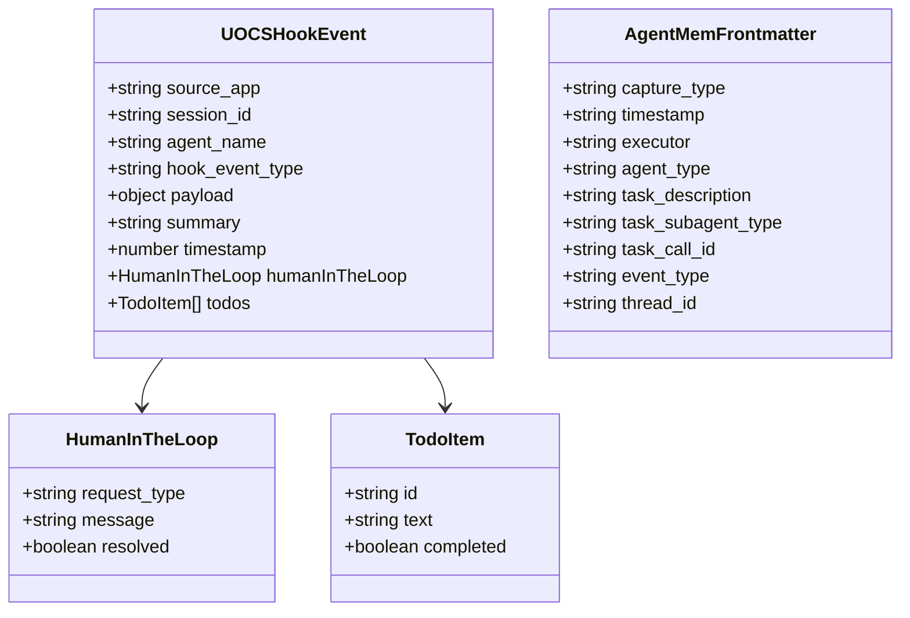

**差分**:
- UOCS は `humanInTheLoop`, `todos` をサポート（人間介入 UI）
- AgentMem は Task 固有のメタデータ（`task_call_id` 等）を詳細に記録

---

## 8. 学習・評価機能

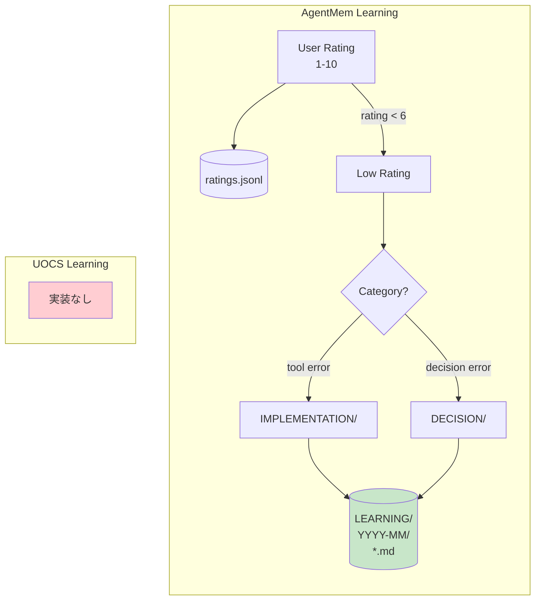

### AgentMem（実装済み）
- **ratings.jsonl**: ユーザ評価スコア (1-10)
- **LEARNING ディレクトリ**: 低評価 (<6) の記録を SYSTEM/ALGORITHM に分類
- 継続改善のためのフィードバックループ

---

## 9. 移植状況サマリー

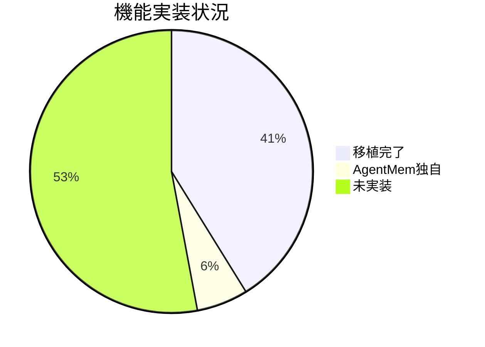

| 機能 | UOCS | AgentMem | 状態 |
|------|------|----------|------|
| Task 出力保存 | ✅ | ✅ | 移植完了 |
| Markdown 永続化 | ✅ | ✅ | 移植完了 |
| 複数 agent_type 対応 | ✅ | ✅ | 移植完了 |
| 完了メッセージ抽出 | ✅ | ✅ | 移植完了 |
| JSONL イベント出力 | ✅ | ✅ | 移植完了 |
| リトライ機能 | ✅ | ✅ | 移植完了 |
| 通知（ローカル） | ✅ | ✅ | 移植完了 |
| 評価・学習機能 | ❌ | ✅ | AgentMem 独自 |
| WebSocket ストリーミング | ✅ | ❌ | **未実装** |
| HTTP API | ✅ | ❌ | **未実装** |
| ダッシュボード UI | ✅ | ❌ | **未実装** |
| フィルタ・検索 UI | ✅ | ❌ | **未実装** |
| バックグラウンドタスク監視 | ✅ | ❌ | **未実装** |
| テーマシステム | ✅ | ❌ | **未実装** |
| Human-in-the-Loop | ✅ | ❌ | **未実装** |
| TODO 追跡 | ✅ | ❌ | **未実装** |
| Haiku 要約 | ✅ | ❌ | **未実装** |

---

## 10. 今後の実装候補（優先度順）

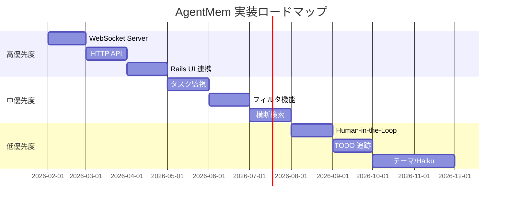

### 高優先度
1. **WebSocket サーバー**: observability-events.jsonl をリアルタイム配信
2. **HTTP API**: `/events/recent`, `/events/filter-options` エンドポイント
3. **Rails UI 連携**: `apps/web` で JSONL を表示

### 中優先度
4. **バックグラウンドタスク監視**: 実行中タスクのステータス表示
5. **フィルタ機能**: agent_type, session_id での絞り込み
6. **エージェント横断検索**: 複数セッションをまたいだ検索

### 低優先度
7. **Human-in-the-Loop**: 人間介入リクエストの UI
8. **TODO 追跡**: タスクリストの可視化
9. **テーマシステム**: ダッシュボードカスタマイズ
10. **Haiku 要約**: LLM による自動要約

---

## Appendix A: OpenCode 用 AgentMem プラグイン実装ガイド

OpenCode のプラグインシステムを使って AgentMem を統合する方法。

### A.1 アーキテクチャ

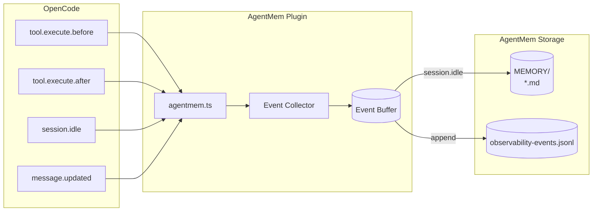

### A.2 ディレクトリ構造

```
~/.config/opencode/
├── opencode.json          # プラグイン登録
├── plugins/
│   └── agentmem.ts        # AgentMem プラグイン
└── package.json           # 依存関係（必要な場合）
```

### A.3 プラグイン実装

#### Step 1: プラグインファイル作成

```typescript
// ~/.config/opencode/plugins/agentmem.ts
import type { Plugin } from "@opencode-ai/plugin"
import { spawn } from "child_process"
import { appendFileSync, mkdirSync, writeFileSync, existsSync } from "fs"
import { join } from "path"
import { homedir } from "os"

interface AgentMemEvent {
  source_app: string
  session_id: string
  hook_event_type: string
  summary: string
  agent_name?: string
  timestamp: number
  payload: Record<string, unknown>
}

// イベントバッファ（セッション完了時にまとめて書き出し）
const eventBuffer: AgentMemEvent[] = []

// 設定
const AGENTMEM_ROOT = process.env.AGENTMEM_ROOT || join(homedir(), ".agent-kit", "MEMORY")
const JSONL_PATH = join(AGENTMEM_ROOT, "STATE", "observability-events.jsonl")

function ensureDir(path: string) {
  if (!existsSync(path)) {
    mkdirSync(path, { recursive: true })
  }
}

function appendEvent(event: AgentMemEvent) {
  ensureDir(join(AGENTMEM_ROOT, "STATE"))
  appendFileSync(JSONL_PATH, JSON.stringify(event) + "\n")
}

function flushEvents(sessionId: string) {
  // バッファ内のイベントを JSONL に書き出し
  for (const event of eventBuffer) {
    appendEvent(event)
  }
  eventBuffer.length = 0
}

export const AgentMemPlugin: Plugin = async ({ $, client, directory }) => {
  const sessionId = `opencode-${Date.now()}`

  await client.app.log({
    service: "agentmem",
    level: "info",
    message: `AgentMem plugin initialized for session: ${sessionId}`,
  })

  return {
    // ツール実行前（PreToolUse 相当）
    "tool.execute.before": async (input, output) => {
      const event: AgentMemEvent = {
        source_app: "opencode",
        session_id: sessionId,
        hook_event_type: "PreToolUse",
        summary: `Tool: ${input.tool}`,
        timestamp: Date.now(),
        payload: {
          tool_name: input.tool,
          tool_input: output.args,
        },
      }
      eventBuffer.push(event)

      await client.app.log({
        service: "agentmem",
        level: "debug",
        message: `PreToolUse: ${input.tool}`,
      })
    },

    // ツール実行後（PostToolUse 相当）
    "tool.execute.after": async (input, output) => {
      const event: AgentMemEvent = {
        source_app: "opencode",
        session_id: sessionId,
        hook_event_type: "PostToolUse",
        summary: `Tool completed: ${input.tool}`,
        timestamp: Date.now(),
        payload: {
          tool_name: input.tool,
          tool_result: typeof output === "string" ? output.slice(0, 500) : JSON.stringify(output).slice(0, 500),
        },
      }
      eventBuffer.push(event)
    },

    // 汎用イベントハンドラ
    event: async ({ event }) => {
      // セッション開始（SessionStart 相当）
      if (event.type === "session.created") {
        const agentEvent: AgentMemEvent = {
          source_app: "opencode",
          session_id: sessionId,
          hook_event_type: "SessionStart",
          summary: "Session started",
          timestamp: Date.now(),
          payload: { cwd: directory },
        }
        eventBuffer.push(agentEvent)
      }

      // メッセージ更新（UserPromptSubmit 相当）
      if (event.type === "message.updated") {
        const agentEvent: AgentMemEvent = {
          source_app: "opencode",
          session_id: sessionId,
          hook_event_type: "UserPromptSubmit",
          summary: "Message updated",
          timestamp: Date.now(),
          payload: { event_data: event },
        }
        eventBuffer.push(agentEvent)
      }

      // セッション完了（Stop 相当）
      if (event.type === "session.idle") {
        const agentEvent: AgentMemEvent = {
          source_app: "opencode",
          session_id: sessionId,
          hook_event_type: "Stop",
          summary: "Session completed",
          timestamp: Date.now(),
          payload: {},
        }
        eventBuffer.push(agentEvent)

        // バッファをフラッシュ
        flushEvents(sessionId)

        // 既存の Ruby スクリプトを呼び出し（オプション）
        try {
          await $`ruby ${homedir()}/Work/agent-kit/scripts/agentmem_notify.rb`
        } catch (e) {
          // 失敗しても続行（fire-and-forget）
        }

        // 通知を送信
        await $`notify-send "AgentMem" "Session completed" 2>/dev/null || true`

        await client.app.log({
          service: "agentmem",
          level: "info",
          message: `Session ${sessionId} completed, ${eventBuffer.length} events flushed`,
        })
      }

      // セッションコンパクション
      if (event.type === "session.compacted") {
        const agentEvent: AgentMemEvent = {
          source_app: "opencode",
          session_id: sessionId,
          hook_event_type: "PreCompact",
          summary: "Session compacted",
          timestamp: Date.now(),
          payload: {},
        }
        appendEvent(agentEvent) // 即座に書き出し
      }

      // エラー
      if (event.type === "session.error") {
        const agentEvent: AgentMemEvent = {
          source_app: "opencode",
          session_id: sessionId,
          hook_event_type: "Error",
          summary: "Session error",
          timestamp: Date.now(),
          payload: { error: event },
        }
        appendEvent(agentEvent)
      }
    },
  }
}
```

#### Step 2: 設定ファイルに登録（npm 版の場合）

```json
// ~/.config/opencode/opencode.json
{
  "$schema": "https://opencode.ai/config.json",
  "theme": "system",
  "plugin": []
}
```

> ローカルプラグインは `~/.config/opencode/plugins/` に置くだけで自動読み込みされる。

#### Step 3: 依存関係（必要な場合）

```json
// ~/.config/opencode/package.json
{
  "dependencies": {
    "@opencode-ai/plugin": "latest"
  }
}
```

### A.4 イベント対応表

| OpenCode Event | AgentMem Event | 説明 |
|----------------|----------------|------|
| `tool.execute.before` | `PreToolUse` | ツール実行前 |
| `tool.execute.after` | `PostToolUse` | ツール実行後 |
| `session.created` | `SessionStart` | セッション開始 |
| `session.idle` | `Stop` | セッション完了（バッファフラッシュ） |
| `session.compacted` | `PreCompact` | コンテキスト圧縮 |
| `session.error` | `Error` | エラー発生 |
| `message.updated` | `UserPromptSubmit` | メッセージ更新 |
| `file.edited` | `FileEdited` | ファイル編集 |

### A.5 高度な機能

#### セキュリティ検証（ツールブロック）

```typescript
"tool.execute.before": async (input, output) => {
  // 危険なコマンドをブロック
  if (input.tool === "bash") {
    const cmd = output.args.command || ""
    if (cmd.includes("rm -rf /") || cmd.includes(":(){ :|:& };:")) {
      throw new Error("Dangerous command blocked by AgentMem")
    }
  }

  // .env ファイルの読み取りをブロック
  if (input.tool === "read" && output.args.filePath?.includes(".env")) {
    throw new Error("Reading .env files is not allowed")
  }
}
```

#### 評価キャプチャ

```typescript
event: async ({ event }) => {
  if (event.type === "message.updated") {
    const content = event.content || ""
    // "7 - good work" のような評価を検出
    const ratingMatch = content.match(/^(10|[1-9])(?:\s*[-:]\s*|\s+)?(.*)$/i)
    if (ratingMatch) {
      const rating = parseInt(ratingMatch[1])
      const comment = ratingMatch[2]?.trim()

      appendEvent({
        source_app: "opencode",
        session_id: sessionId,
        hook_event_type: "ExplicitRating",
        summary: `Rating: ${rating}/10`,
        timestamp: Date.now(),
        payload: { rating, comment },
      })

      // 低評価は学習用に保存
      if (rating < 6) {
        // LEARNING ディレクトリに保存するロジック
      }
    }
  }
}
```

#### カスタムツール追加

```typescript
import { tool } from "@opencode-ai/plugin"

export const AgentMemPlugin: Plugin = async (ctx) => {
  return {
    tool: {
      agentmem_search: tool({
        description: "Search AgentMem history for past agent outputs",
        args: {
          query: tool.schema.string(),
          limit: tool.schema.number().optional(),
        },
        async execute(args) {
          // MEMORY ディレクトリを検索
          const results = await searchMemory(args.query, args.limit || 10)
          return JSON.stringify(results, null, 2)
        },
      }),
    },
    // ... 他のフック
  }
}
```

### A.6 デバッグ

```bash
# ログを確認
opencode --print-logs --log-level DEBUG

# プラグインが読み込まれているか確認
ls ~/.config/opencode/plugins/

# JSONL 出力を確認
tail -f ~/.agent-kit/MEMORY/STATE/observability-events.jsonl
```

### A.7 Codex との併用

Codex と OpenCode の両方で AgentMem を使う場合、同じ JSONL ファイルに書き込むことで統合できる。

```mermaid
flowchart TB
    subgraph Codex
        CX[notify] --> RB[agentmem_notify.rb]
    end

    subgraph OpenCode
        OC[Plugin Events] --> TS[agentmem.ts]
    end

    subgraph "共通ストレージ"
        RB --> JL[(observability-events.jsonl)]
        TS --> JL
        JL --> MD[("MEMORY/*.md")]
    end
```

---

## 参考ファイル

### UOCS (PAI)
- `../oss/PAI/Packs/pai-observability-server/src/Observability/apps/server/src/index.ts` - メインサーバー
- `../oss/PAI/Packs/pai-observability-server/src/Observability/apps/server/src/file-ingest.ts` - イベント取得
- `../oss/PAI/Packs/pai-observability-server/src/Observability/apps/client/src/` - Vue ダッシュボード

### AgentMem (agent-kit)
- `scripts/agentmem_notify.rb` - Codex 用メイン実装
- `plans/agentmem.md` - 設計計画書
- `features/agentmem_*.feature` - テストスイート

### OpenCode
- [OpenCode Plugin Documentation](https://opencode.ai/docs/plugins/) - 公式ドキュメント
- `~/.config/opencode/plugins/agentmem.ts` - OpenCode 用プラグイン（実装予定）

### アーキテクチャ図
- `plans/2026-01-25-16-05-uocs-architecture.png` - UOCS アーキテクチャ図（nano-banana 生成）
